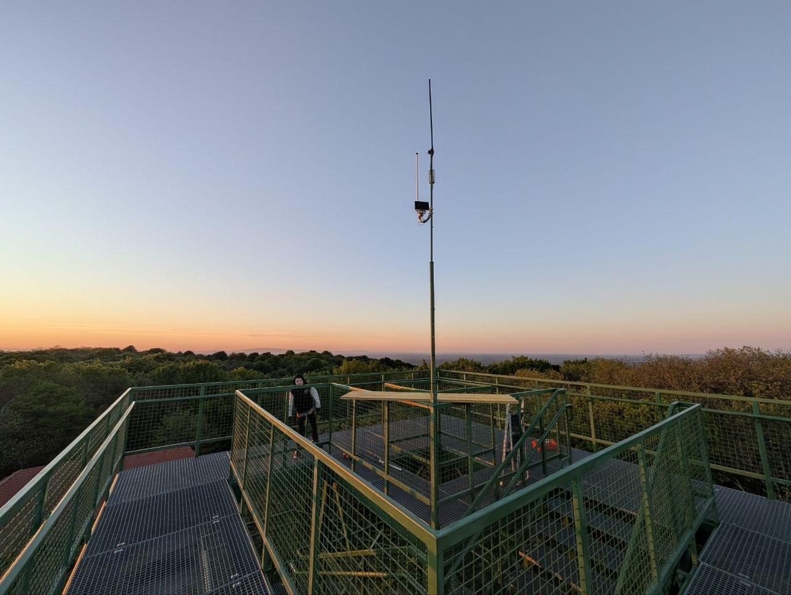

# Montaža i zaštita vanjskih node-ova

## Brtvljenje

Voda je najčešći ubojica vanjskih node-ova. Provjerene metode iz zajednice:

- **Antenski konektori:** omotaj **3M samovulkanizirajućom (rastezljivom gumenom)
  električarskom trakom** — rastezanjem se lijepi sama za sebe i brtvi. Obuhvati i dio
  iznad konektora da traka "ima mesa" za prihvat.
- **Prolazi kabela i spojevi kućišta:** Sika tekuća guma u tubi — provjereno drži 3+
  godine na krovu.
- Ako je antena montirana direktno na kućište, zabrtvi konektor **i iznutra**.
- Za konektore koje stock antena inače pokriva postoji 3D printani "gap filler" od
  fleksibilnog materijala — vidi [3D print](3d-print.md).

## Kondenzacija i vlaga

- Ugradi **breather valve** (ventil za izjednačavanje tlaka) u kućište — sprječava
  uvlačenje vlažnog zraka kod temperaturnih promjena.
- U kućište stavi **silica gel** (varijanta s indikatorom boje pokazuje kada je za
  sušenje; ~10 €/450 g).
- Oprez s očitanjima senzora vlage u zatvorenom kućištu: relativna vlaga ovisi o
  temperaturi pa "pad vlage" pri zagrijavanju može biti prividan.

## Gromobranska zaštita

> **Upozorenje:** Node **ne montiraj direktno na gromobransku instalaciju** 

Ispravna zaštita prema iskustvima zajednice:

1. **Plinski odvodnik prenapona (gas discharge arrester)** između antene i uređaja, s
   vlastitim izvodom na uzemljenje.
2. Nosač antene i izvod odvodnika spojiti na **ispravno uzemljenje** (gromobransku
   traku) — odvojeno od same gromobranske hvataljke.
3. Minimalna varijanta (bolja od ničega): izvod odvodnika na masu antenskog nosača radi
   pražnjenja statičkog elektriciteta od vjetra.

## Pozicioniranje

- Presudni su **visina i linija optičke vidljivosti** — metar više na stupu zna donijeti
  više od promjene antene.
- Izbjegavaj neposrednu blizinu drugih odašiljača: zabilježen je slučaj node-a kojeg je
  zaglušivao UKV repetitor na istoj lokaciji svaki put kad bi se aktivirao.
- Za udaljene solarne node-ove planiraj upravljanje unaprijed (Remote Admin, isključeni
  WiFi/BT) — vidi [Prvi koraci](../postavke/prvi-koraci.md).

## Dozvole za postavljanje

- **Privatni objekti:** dogovor s vlasnikom (u praksi zajednice: krovovi kuća, zgrada,
  radioklubovi, tvrtke članova).
- **Javni i državni objekti (napušteni dimnjaci, tornjevi i sl.):** formalna
  procedura ne postoji. Preporuka je izravan kontakt s lokalnim radioklubovima
  (često imaju uspostavljene veze i iskustvo s takvim lokacijama); za stambene
  zgrade dogovor s upravom zgrade/vlasnicima stanova, kao i kod privatnih kuća.
- Za regulatorna pitanja RF spektra nadležan je HAKOM — vidi
  [Pravila](../zajednica/pravila.md).

<figure class="cromesh-doc-photo">
  
</figure>
