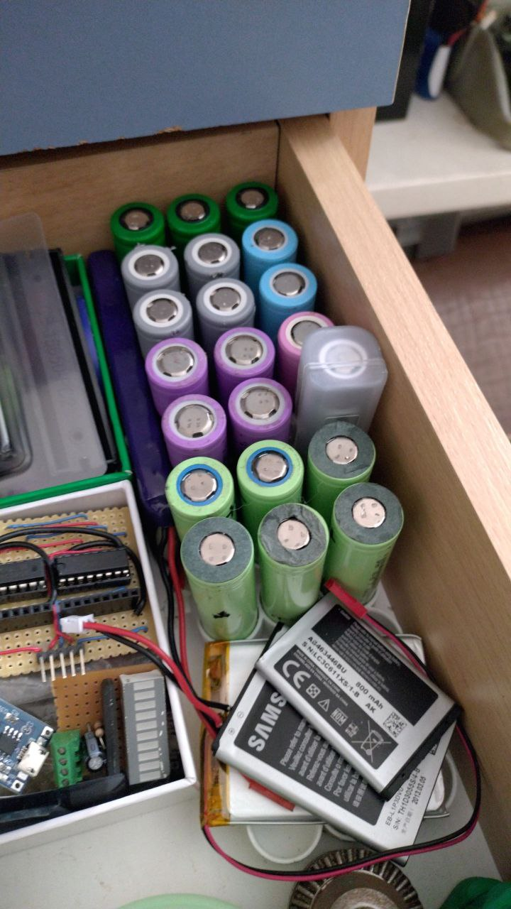

# Punjenje i oživljavanje 18650 Li-ion ćelija

!!! warning
    Kod sumnje u stanje ili povijest ćelije, sigurnije je reciklirati je nego
    pokušati oživljavanje.

## Očitanje napona ćelije

Prvi korak je izmjeriti napon ćelije u mirovanju (bez opterećenja) i pročitati
ga prema rasponu u tablici ispod.

| Napon | Stanje / preporuka |
|---|---|
| **0,00V** | Vjerojatno je aktivirana unutarnja zaštita — ne preporučuje se zaobilaženje zaštite, tretirati kao mrtvu ćeliju. |
| **0,02–0,2V** | Vjerojatno mrtva ćelija — rezultati oživljavanja obično su loši. |
| **0,2–1,8V** | Ćelija se nakon oživljavanja vjerojatno brzo prazni. |
| **1,8–3,6V** | Taman raspon za oživljavanje. |
| **3,6–4,2V** | Normalni radni napon. |
| **4,5V i više** | Vjerojatno pogrešno mjerenje ili ozbiljno prenapunjena ćelija — litijeva ćelija u tom stanju predstavlja rizik od požara (gori čak i pod vodom). Odmah prekinuti rad s ćelijom. |

## Kada ne oživljavati

- **Napon padne ispod ~1,5V unutar tjedan dana praćenja** — ne oživljavati
  (rizik unutarnjeg kratkog spoja), pravilno reciklirati.
- **Napon padne npr. ~0,5V unutar nekoliko dana bez opterećenja** (ćelija nije
  bila pod trošilom) — ukazuje na visoko samopražnjenje ili interni kvar,
  reciklirati.
- **Napon nakon oživljavanja brzo pada** — ćelija se smatra oštećenom,
  potrebno ju je reciklirati.
- **Napon vidljivo pada tijekom kratkog kontinuiranog mjerenja** (desetak
  sekundi) — ćelija vjerojatno ne drži punjenje, reciklirati.
- **Vidljivo oštećenje** (probušeno kućište, ulubljenje, napuhanost, korozija) —
  nikad ne oživljavati.

## Postupak

1. Nakratko (~15 s) spojiti niskonaponski izvor (5V, struja ograničena na
   10–100mA) na kontakte ćelije — pazeći na polaritet (+ na vrh, − na kućište).
2. Odspojiti i izmjeriti napon u mirovanju.
3. Ponavljati dok napon ne dosegne ~3,6–3,9V, zatim nastaviti standardnim
   punjačem.

Neki punjači (XTAR, Nitecore i slični) imaju ugrađen način "aktivacija na 0V" /
"boost" koji ovo radi automatski.

## Punjenje

CC-CV do 4,20V (±0,05V). Nikad ne ostavljati na trajnom trickle punjenju nakon
pune napunjenosti.

## Praćenje nakon oživljavanja

Oživljenim i upcikliranim ćelijama obavezno pratiti napon kroz vrijeme, ne
samo neposredno nakon postupka:

- Pratiti **trend stabilizacije** napona. Kad se napon prestane značajno
  mijenjati, ćelija se stabilizirala.
    - Ako je stabilizirani napon u radnom rasponu (3,6–4,2V) — ćelija je u
      redu za daljnju upotrebu.
    - Ako je stabilizirani napon ispod radnog raspona, nakon par ciklusa
      punjenja ćelija bi mogla postići stabilnije, više napone.
    - Ako napon uporno ostaje ispod radnog raspona unatoč više ciklusa
      punjenja, postoji mogućnost unutarnjeg kratkog spoja — ćelija je
      neispravna. Pravilno i odgovorno je odložiti u otpad.

## Unutarnji otpor

| Unutarnji otpor | Stanje ćelije |
|---|---|
| ~50–100 mΩ | Zdrava / kao nova |
| 100–250 mΩ | Korištena, ali upotrebljiva |
| 250–400 mΩ | Granično |
| preko 400 mΩ | Istrošena |

## Skladištenje

Za dugoročno skladištenje: napon mirovanja ~3,7–3,9V.

*Ovo su informacije iz Hobbyist priručnika, a ne sigurnosna certifikacija.*

<figure class="cromesh-doc-photo">
  
</figure>
