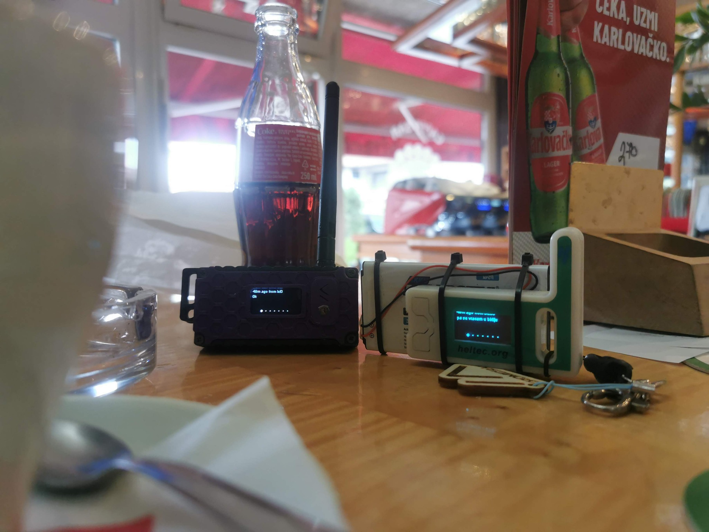

# Dobrodošli u CroMesh dokumentaciju

Sve što trebate za izgradnju, korištenje i razumijevanje CroMesh mreže — na jednom mjestu.

**Otvoreno. Neovisno. Za zajednicu.**

[ :octicons-rocket-24: Kreni od početka](uvod.md){ .cromesh-button .cromesh-button-primary }
[ :octicons-book-24: Pregledaj vodiče](postavke/prvi-koraci.md){ .cromesh-button }

:material-vector-polyline:{ .cromesh-icon }
### Mesh mreža
Decentralizirana komunikacija bez centralnog poslužitelja.

:material-access-point-network:{ .cromesh-icon }
### Otvoreno i besplatno
Otvoren kod, otvorena dokumentacija i otvorena mreža.

:material-account-group:{ .cromesh-icon }
### Zajednica
Znanje dijelimo, pomažemo jedni drugima i zajedno gradimo mrežu.

:material-shield-check:{ .cromesh-icon }
### Neovisan
Privatnost, sigurnost i sloboda komunikacije.

## Brzi pristup

:octicons-rocket-24:
**Prvi koraci**
Kako započeti s CroMesh mrežom.
[Otvori vodič →](postavke/prvi-koraci.md)

:octicons-tools-24:
**Montaža čvora**
Hardver, firmware i osnovna konfiguracija.
[Postavke →](postavke/index.md)

:material-map-outline:
**Karta mreže**
Pregled aktivnih čvorova i pokrivenosti.
[Otvori kartu →](https://map.cromesh.eu/)

:material-help-circle-outline:
**Česta pitanja**
Odgovori na najčešća pitanja zajednice.
[Otvori FAQ →](faq.md)

**CroMesh** je hrvatska zajednica koja gradi decentraliziranu, off-grid LoRa mesh mrežu na području Republike Hrvatske. Mreža radi na **868 MHz ISM pojasu (EU_868)**.

!!! info ""
    `cromesh.eu` i `docs.cromesh.eu` neovisni su, neslužbeni projekti CroMesh zajednice i nisu službeno povezani s niti odobreni od strane Meshtastic LLC. „Meshtastic®” je registrirani zaštitni znak tvrtke Meshtastic LLC.

<figure class="cromesh-doc-photo">
  
</figure>
