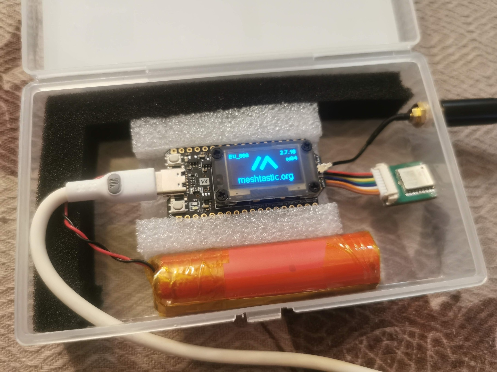

# ESP32 — svestranost uz veću potrošnju

ESP32 je stariji, ali i dalje vrlo popularan čip. Njegova glavna prednost je **svestranost**, jer u sebi ima ugrađen **WiFi i Bluetooth**.  
To znači da se uređaji s ESP32 čipom mogu povezati na kućnu mrežu ili koristiti za naprednije funkcionalnosti.

Međutim, ta svestranost ima svoju cijenu — **veću potrošnju energije**.  
Ako vam je najvažnije trajanje baterije, imajte na umu da će uređaji s ovim čipom trošiti više.

## Primjeri uređaja

- **LILYGO® TTGO T-Beam**  
- **Heltec V3**

<figure class="cromesh-doc-photo">
  
</figure>
