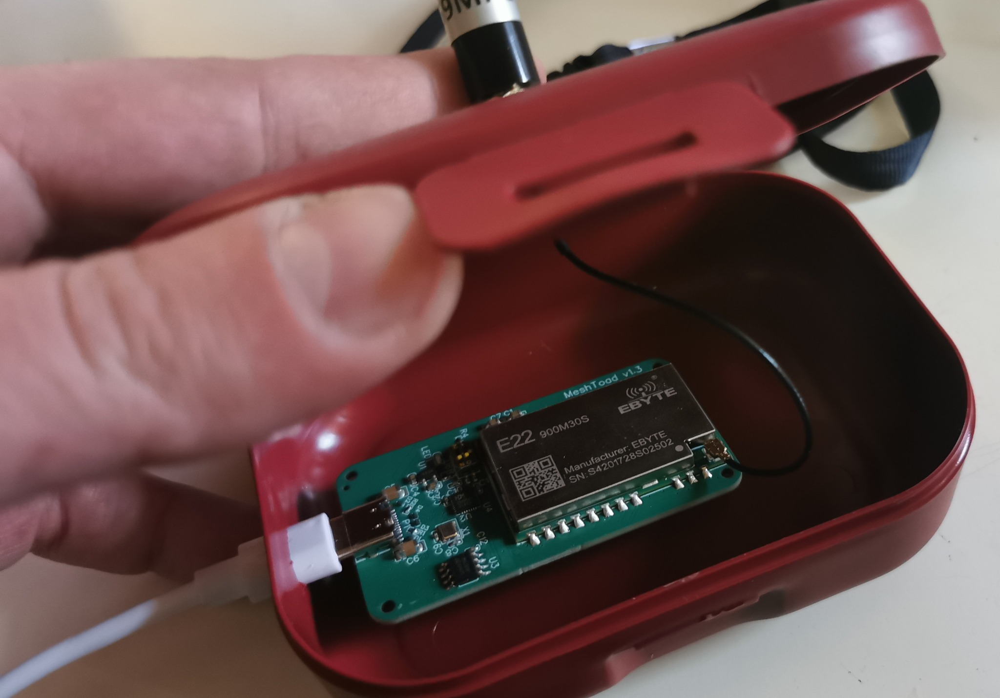

# RP2040 — niska potrošnja i dvojezgreni pogon

RP2040 je čip tvrtke **Raspberry Pi**.  
Poput nRF52, štedljiv je i pogodan za uređaje kod kojih je važna **niska potrošnja energije**.

Ipak, imajte na umu da na nekim uređajima, poput **Raspberry Pi Pico W**  
**Bluetooth podrška za Meshtastic još nije dostupna**.

## Primjeri uređaja

- **Raspberry Pi Pico** + **Waveshare LoRa modul**

<figure class="cromesh-doc-photo">
  
</figure>
