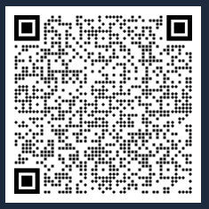

# Channels  
**0 – Primarni kanal**  
  
- **Naziv**: `LongFast`  
- **Ključ**: `AQ==`  
  
{ width="300" }{ width="300" }   
- Možete isključiti **poziciju i preciznu lokaciju** ako ne želite dijeliti svoju lokaciju.  
- Za precizno dijeljenje lokacije koristite bilo kojeg clienta.

**1 – cromesh.eu**  

- **Naziv**: `cromesh.eu`  
- **Uplink enabled**: Isključeno  
- **Downlink enabled**: Isključeno  

Skeniraj QR kod za brzo dodavanje **cromesh.eu** kanala u Meshtastic aplikaciju:

{ width="220" }
