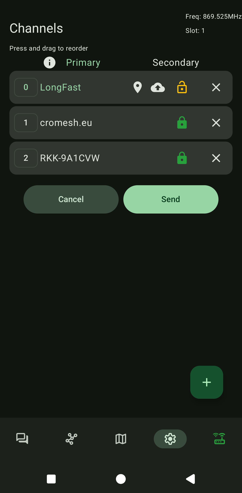
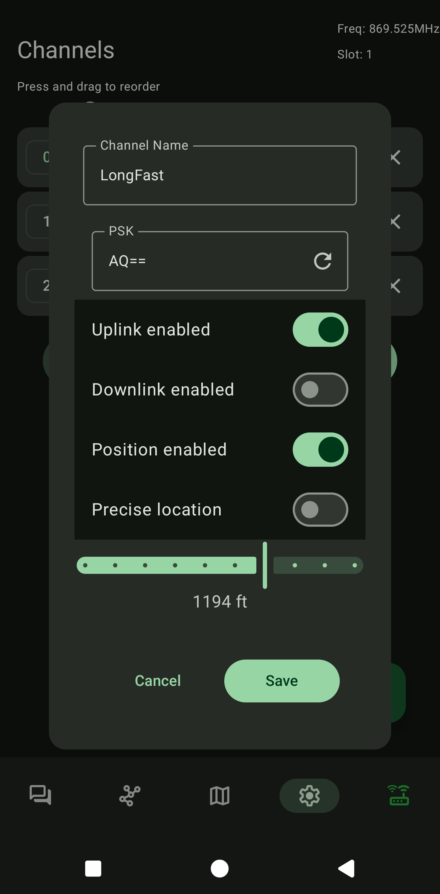

# Channels  
**0 – Primarni kanal**  
  
- **Naziv**: `LongFast`  
- **Ključ**: `AQ==`  
  
{ width="300" }{ width="300" }   
- Možete isključiti **poziciju i preciznu lokaciju** ako ne želite dijeliti svoju lokaciju.  
- Za precizno dijeljenje lokacije koristite bilo kojeg clienta.
