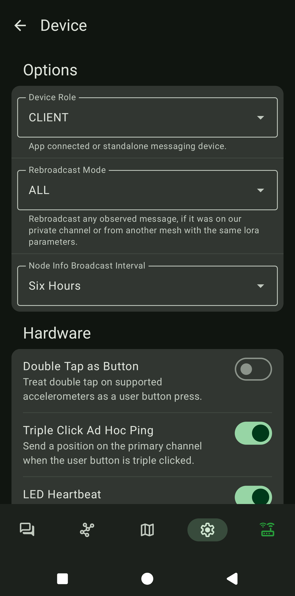

# Device
 
**Uloga Uređaja**  
  
- **Client Mute** — Najbolje za vozila ili situacije s više uređaja na istom mjestu.  
  Ne prenosi poruke drugih node-ova, ali i dalje šalje vlastite poruke.  
- **Client** — Preporučeno za kućne bazne stanice ili primarne uređaje.  
  Prenosi poruke koje primi.  
- **Client Base** — Za dobro pozicioniran "bazni" node (npr. tavan, krov) kojemu su ostali tvoji node-ovi označeni kao favoriti — njihov promet ima prednost, dok ostatak tretira kao Client.  
- **Router** — Isključivo za infrastrukturne node-ove na istaknutim pozicijama; nemoj koristiti ovu ulogu osim ako točno znaš sve tehničke detalje.  
  Uloga **Client** već omogućuje prenošenje poruka koje primi.   
  Pogledaj [službenu dokumentaciju](https://meshtastic.org/blog/choosing-the-right-device-role/) za više informacija.  
  
**Node Info Brodcast Interval** — 6 sati.  
{ width="300" }  