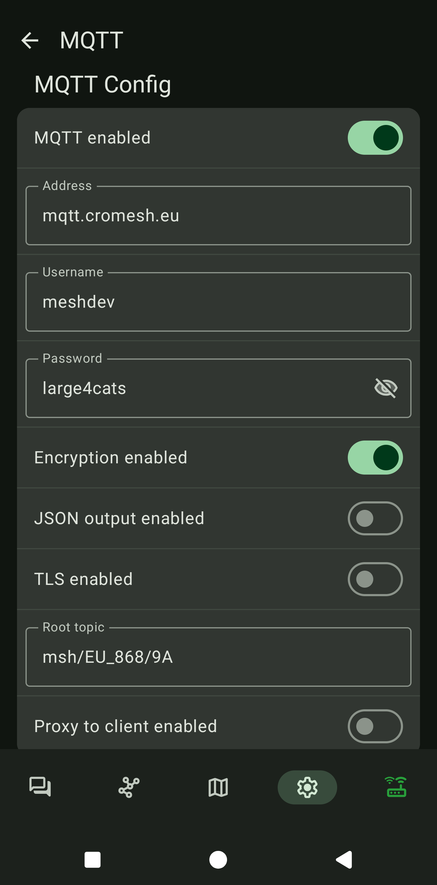

# MQTT
Ako želiš slati podatke na internet, to možeš učiniti putem uređaja s Wi-Fi čipom ili preko MQTT proxy clienta u mobilnoj aplikaciji.  
Ovo je među naprednijim postavkama. Ako ne znaš što je **"MQTT"**, ostavi ga isključenim. Za korištenje Meshtastic-a nije nužno potrebno uključiti MQTT.  
  
- **Adress**: mqtt.cromesh.eu  
- **Username**: meshdev  
- **Password**: large4cats  
- **Encryption Enabled**: Uključeno (Ako nije uključeno sve poruke preko mqtt će ići nešifrirane)
- **JSON output enabled**: Isključeno  
- **TLS enabled**: Isključeno  
- **root topic**: msh/EU_868/**9A**  
Točno ovako – velika i mala slova su bitna.  
  
{ width="300" }  

Također je bitno konfigurirati sam LongFast kanal kao što je prikazano ovdje:
{ width="300" }  
