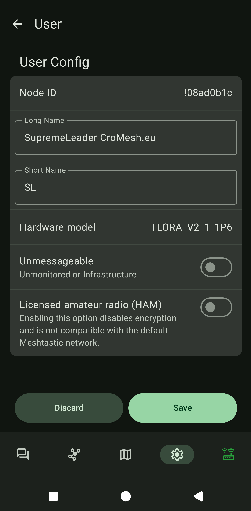

# User  
Ovdje se unose postavke vezane za korisnika meshtastic uređaja   
  
- **Long Name**: Nešto opisno — npr. vaše ime, Discord nadimak ili radioamaterski pozivni znak.  
  Možete uključiti i e-mail ili web adresu.  
  *Savjet:* Dodajte “CroMesh.eu” u svoje ime da nas drugi lakše pronađu.  
- **Short Name**: Maksimalno 4 znaka — jedinstveno za taj uređaj.  
  To je ime koje se prikazuje u chatu. Možete koristiti i emojije.  
- **Unmessageable**: Uključeno(Samo za uređaje s u infrastruktura ili nitko ne gleda poruke na njima)  
- **Licencirani Operator**: Ne uključujte osim ako ste licencirani [radioamater](https://hr.wikipedia.org/wiki/Radioamaterizam).  
  *(Ako to omogućite, nećete moći komunicirati s korisnicima na zadanim kanalima.)*  
  
{ width="300" }  